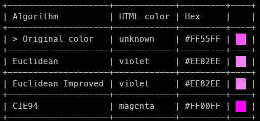

# Co(lor) di(fference/stance)

Color perception difference algorithms and utilities.

If you've ever wanted (nobody ever wanted) to use only named html colors in development, but didn't know how to find the color closest to #123456 that has html name, then this is the repository for you.

## Motivation

We can't just use the Euclidean distance between two RGB colors because the RGB color space is not "perceptually uniform". To understand more, I recommend reading the article ["Perceptually uniform color spaces"](https://programmingdesignsystems.com/color/perceptually-uniform-color-spaces/index.html#perceptually-uniform-color-spaces-e7zMSWy).

The primary motivation was to find the closest color that has an html name, but since there are many algorithms for this (because there is no correct answer for this question), why not implement all of them and compare results yourself.

## Example



## Installation

### Rust (cargo)

```bash
cargo install --git https://github.com/woojiq/codi --locked
```

### Nix (flake) without installation

```bash
nix run 'github:woojiq/codi?dir=nix'
```

## Usage

```
Usage:
    codi <color>

Args:
    <color> Hex color, e.g. "#000000" or "ffffff"

Options:
    --help                  Prints help information
    --version               Prints version
    --all-html              Displays all named html color
```

```bash
$ codi A1A2A3               # pass hex color with or without "#" symbol
$ hyprpicker | xargs codi   # run picker that returns hex color
$ codi --all-html           # print all named html colors
```

## Developing

```bash
git clone https://github.com/woojiq/codi
cargo build
```

If you have the nix package manager, you can run Github CI locally: `nix flake check ./nix`.

## TODO
- [ ] [API guidelines](https://rust-lang.github.io/api-guidelines/about.html)
- [ ] Tests
- [ ] Analyze produced assembly and try to optimize something (for learning purposes)
- [ ] No-std support: not easy because no_std doesn't have common float operations
- [ ] Xyz -> Rgb, Lab -> Xyz conversions + fuzzy testing
